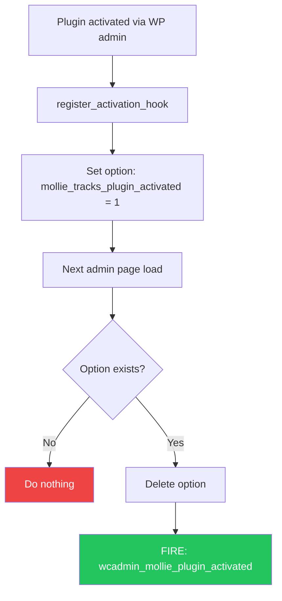
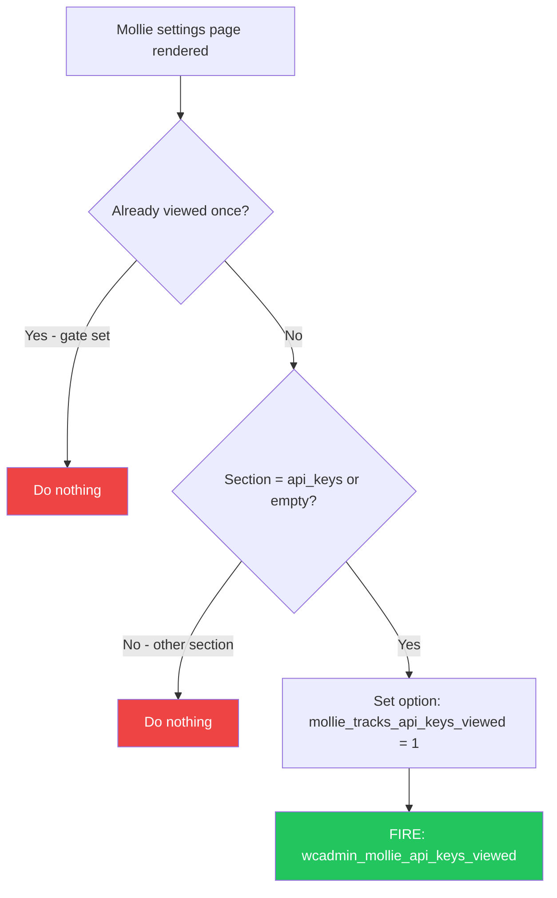
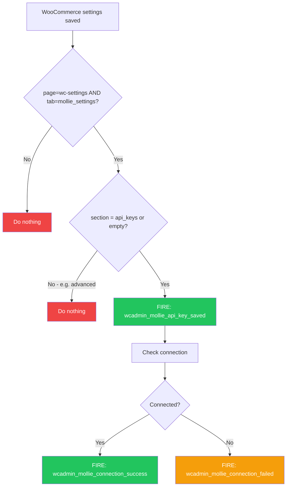
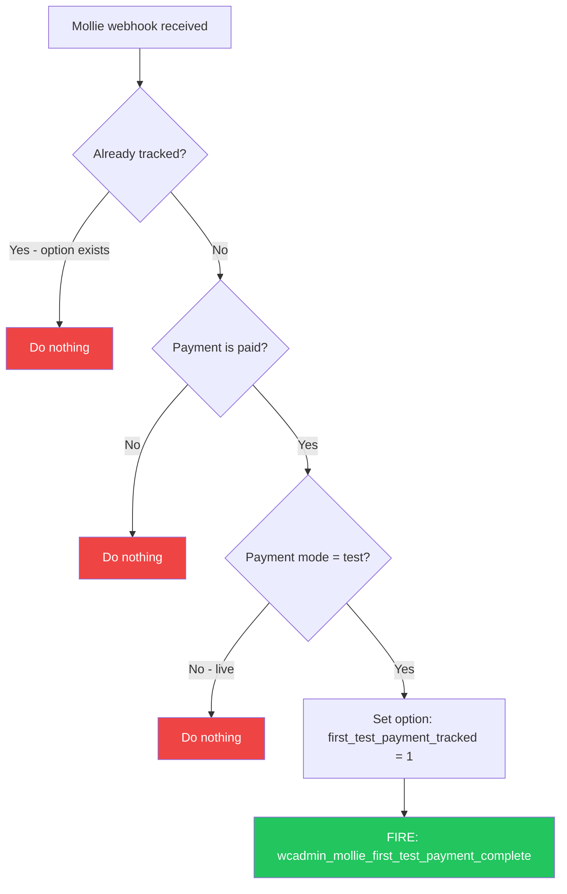
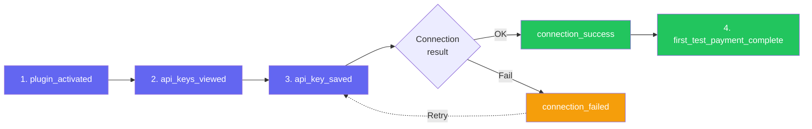

# Mollie Tracks Events Flow

## All events include these common properties
| Property | Example |
|---|---|
| `plugin_version` | `8.1.6` |
| `store_url` | `example.com` (stripped of `https://` and `www.`) |

---

## Event Flow Diagrams

### 1. Plugin Activation

**Event:** `wcadmin_mollie_plugin_activated`
**Parameters:** _(common only)_

| Fires | Does NOT fire |
|---|---|
| First admin page load after activation | Any admin page load without activation flag |
| | Second+ admin page loads (flag consumed) |

---

### 2. API Keys Viewed

**Event:** `wcadmin_mollie_api_keys_viewed`
**Parameters:** _(common only)_

| Fires | Does NOT fire |
|---|---|
| First visit to API keys tab | Second+ visits (one-time gate set) |
| | Other settings sections (payment_methods, advanced) |

---

### 3. API Key Saved + Connection Result

**Event:** `wcadmin_mollie_api_key_saved`

| Parameter | Type | Example |
|---|---|---|
| `payment_mode` | `test` \| `live` | Current Mollie Payment Mode setting |
| `has_test_key` | `boolean` | `true` if test API key exists in DB |
| `has_live_key` | `boolean` | `true` if live API key exists in DB |

**Event:** `wcadmin_mollie_connection_success`

| Parameter | Type | Example |
|---|---|---|
| `payment_mode` | `test` \| `live` | Active payment mode |

**Event:** `wcadmin_mollie_connection_failed`

| Parameter | Type | Example |
|---|---|---|
| `payment_mode` | `test` \| `live` | Active payment mode |
| `error_code` | `int` | `401` |
| `error_message` | `string` | `Error executing API call (401: Unauthorized Request)...` |

| Fires | Does NOT fire |
|---|---|
| Save on API keys section | Save on advanced section |
| Save on empty section (defaults to api keys) | Save on non-Mollie WC settings page |
| One api_key_saved + one connection result per save | |

---

### 4. First Test Payment

**Event:** `wcadmin_mollie_first_test_payment_complete`

| Parameter | Type | Example |
|---|---|---|
| `payment_method` | `string` | `ideal`, `creditcard`, `bancontact` |

| Fires | Does NOT fire |
|---|---|
| First paid test payment via Mollie webhook | Live payments |
| Once per store (until reset, see below) | Unpaid/pending payments |
| | Second+ test payments (flag set) |

**Note:** This event requires Mollie webhooks to reach the site. Local development environments without a tunnel (e.g. ngrok) will never trigger this event.

---

## Complete Activation Funnel

---

## One-Time Event Gates

Three events use one-time flags stored as WordPress options:

| Event | Option | Behavior |
|---|---|---|
| `plugin_activated` | `mollie_tracks_plugin_activated` | Set on activation, deleted after firing |
| `api_keys_viewed` | `mollie_tracks_api_keys_viewed` | Set after first view, persists |
| `first_test_payment_complete` | `mollie_tracks_first_test_payment_tracked` | Set after first test payment, persists |

### What resets these gates

| Action | What resets |
|---|---|
| **Plugin deactivation** (merchant NOT connected) | All three gates cleared — full funnel re-fires on reactivation |
| **Plugin deactivation** (merchant connected) | Only `plugin_activated` re-fires on reactivation; other gates preserved |
| **Clear DB** (Mollie > Advanced > "Clear now") | All Mollie options deleted, including all tracking gates |
| **Plugin uninstall** (with "Remove data on uninstall" enabled) | All Mollie options deleted, including all tracking gates |

"Connected" means the merchant has a test or live API key saved in the database.
